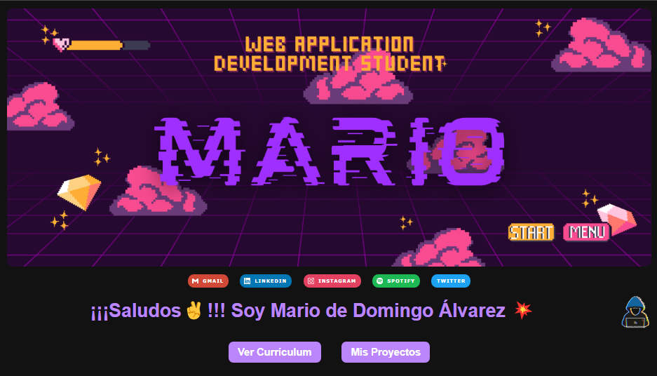
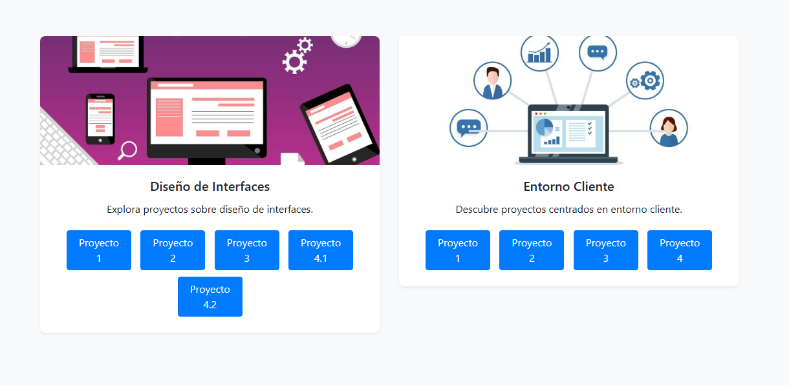
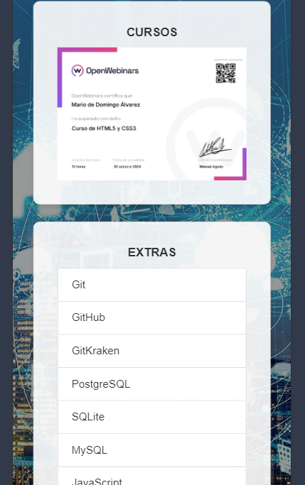

# [wolverine307mda.github.io](https://wolverine307mda.github.io)

En mi página principal encontrarás dos enlaces: a [Mis proyectos](https://github.com/wolverine307mda/RFA) y a mi [Currículum](https://github.com/wolverine307mda/Curriculum).

    

## Proyectos de Entorno Cliente y Diseño Web
En esta pestaña se muestra la división de las dos asignaturas, con enlaces a sus respectivos proyectos:

    

## Currículum

### Vista móvil

|  |  |  |  |
|----------------------------------------|----------------------------------------|----------------------------------------|----------------------------------------|

### Vista tablet

    

### Vista PC

